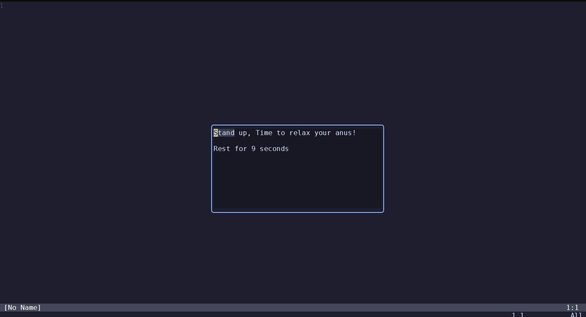

# anal.nvim

## Intro

Anal.nvim is a reminder of **long-time-sitting.**



## Install

Using Lazy:


```lua
{
   "waizui/anal.nvim",
},
```

## Usage

In command mode:

```txt
:Anal [interval] [display time]
```
interval: time in seconds to wait before showing the message (default: 1800)
display time: time in seconds to display the message (default: 300)

